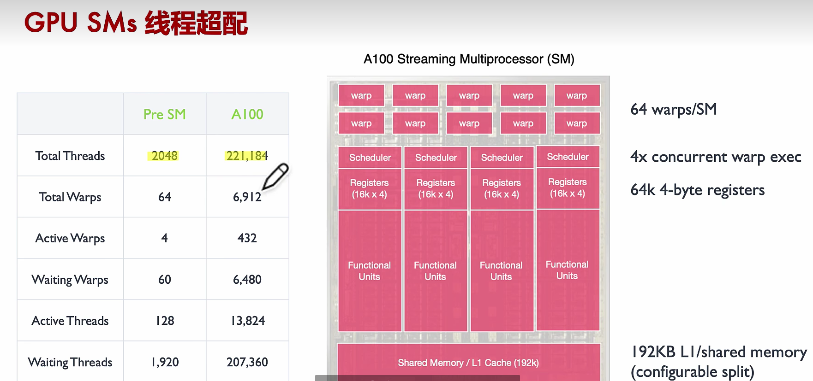

# 概念扫盲

### 并发与并行的区别与联系

并发（Concurrency）和并行（Parallelism）是计算机科学中两个密切相关但又有所区别的概念，它们都与任务的执行方式有关：

1. **并发（Concurrency）**：
   - 并发指的是多个任务在同一个时间段内交替执行的能力。在并发系统中，任务可能实际上并不是同时执行的，但它们被操作系统或执行环境以快速切换的方式调度，给人一种“同时进行”的感觉。
   - 并发通常涉及到任务的调度和上下文切换，允许单个处理器在不同任务之间快速切换，从而实现多任务处理。
   - 并发可以在单核或多核处理器上实现，它依赖于操作系统的调度机制。

2. **并行（Parallelism）**：
   - 并行指的是多个任务或计算过程在同一时刻真正地同时执行。这通常需要多个处理单元（如CPU核心或GPU核心）。
   - 并行计算可以显著提高性能，尤其是在处理可以分解为多个独立子任务的问题时。
   - 并行通常与硬件架构有关，需要支持并行执行的硬件资源。

3. **主要区别**：
   - **时间**：并发是任务在时间上的重叠，而并行是任务在空间上的分布。
   - **执行**：并发可能在单个处理器上通过时间多路复用实现，而并行需要多个物理处理器或核心。
   - **资源利用**：并行可以更充分地利用硬件资源，因为它允许多个任务或操作同时进行。

4. **应用场景**：
   - 并发适用于需要处理多个任务或请求的场景，如服务器处理多个客户端请求。
   - 并行适用于需要大量计算的任务，如科学计算、图形渲染或机器学习。

5. **性能影响**：
   - 并发可以提高单个处理器的利用率，但可能受到上下文切换和调度开销的影响。
   - 并行可以提供线性或超线性的性能提升，但可能受到数据传输、同步和通信开销的限制。

6. **编程模型**：
   - 并发编程需要考虑任务的同步、互斥和死锁等问题。
   - 并行编程需要考虑任务的分解、数据的分配和通信机制。

7. **硬件支持**：
   - 并发可以在没有特殊硬件支持的情况下实现，主要依赖于软件层面的调度。
   - 并行需要硬件层面的支持，如多核CPU、多GPU或分布式计算系统。

总结来说，虽然并发和并行都涉及到多个任务的处理，但并发侧重于任务在时间上的重叠和快速切换，而并行侧重于任务在空间上的分布和同时执行。两者在提高系统性能和处理能力方面都发挥着重要作用。

### SIMD是什么？

SIMD（Single Instruction, Multiple Data）Multiprocessors 是一种并行处理架构，它允许多个数据点同时执行相同的操作。这种架构特别适合执行数据密集型任务，如图形渲染、科学计算和机器学习等。

在 SIMD Multiprocessors 中，每个处理器或核心可以执行多个数据点的相同指令，而不是像传统的标量处理器那样一次只处理一个数据点。这种设计可以显著提高处理速度和效率，尤其是在处理大量数据时。

以下是 SIMD Multiprocessors 的一些关键特点：

1. **指令级并行性**：一个指令可以同时应用于多个数据点，从而实现指令级并行性。

2. **数据并行性**：多个数据点可以并行处理，这在处理大量数据时非常有用。

3. **硬件支持**：现代GPU和某些CPU都支持SIMD指令集，如SSE（Streaming SIMD Extensions）、AVX（Advanced Vector Extensions）等。

4. **向量化**：SIMD通常与向量化编程结合使用，向量化是将标量操作转换为向量操作的过程，以利用SIMD硬件。

5. **性能提升**：通过SIMD Multiprocessors，可以在单个时钟周期内执行多个操作，从而提高性能。

6. **适用性**：SIMD架构特别适合那些可以表示为向量或矩阵操作的算法和应用。

7. **编程模型**：开发者需要使用特定的编程模型和语言特性来编写能够利用SIMD硬件的程序。

8. **硬件实现**：SIMD Multiprocessors可以以多种形式实现，包括专用的SIMD处理器、集成在CPU或GPU中的SIMD单元等。

在GPU架构中，SM（Streaming Multiprocessors）内部的执行单元通常就是SIMD处理器。例如，NVIDIA的GPU中的SM可以包含多个CUDA核心，这些核心可以执行SIMD操作。通过这种方式，GPU可以高效地处理大量的并行计算任务。

### 介绍CUDA的线程、线程块、grid、CUDA stream与SM的关系

CUDA 是 NVIDIA 提供的一种并行计算平台和编程模型，它允许开发者利用 GPU 强大的并行处理能力来加速计算密集型任务。以下是 CUDA 中线程、线程块、网格、CUDA stream 以及它们与 SM（Streaming Multiprocessors）之间的关系：

1. **CUDA 线程（Thread）**：
   - CUDA 线程是 CUDA 程序中的基本执行单元，每个线程可以执行独立的计算任务。
   - 线程被组织在线程块中，并且可以访问自己的寄存器和线程块内的共享内存。

2. **CUDA 线程块（Block）**：
   - 线程块是一组线程的集合，这些线程可以协同工作，共享数据和同步操作。
   - 线程块的大小由开发者定义，并且有最大尺寸限制。线程块内的线程可以通过共享内存进行通信。

3. **CUDA 网格（Grid）**：
   - 网格是由多个线程块组成的集合，代表了 CUDA 程序中所有并行执行的线程块的集合。
   - 网格的维度可以是一维、二维或三维，由开发者根据问题规模和并行需求来定义。

4. **CUDA Stream**：
   - CUDA stream 是一个执行队列，用于管理 GPU 上的任务执行顺序。
   - 每个 stream 可以包含多个 kernel 调用、内存传输或其他 CUDA 操作，它们按照 FIFO（先进先出）的顺序执行。
   - 使用多个 CUDA stream 可以实现任务的异步执行，提高 GPU 资源的利用率。

5. **CUDA SM（Streaming Multiprocessor）**：
   - SM 是 GPU 上的物理处理单元，负责执行 CUDA 程序中的线程块。
   - 每个 SM 包含多个 CUDA 核心，可以并行处理多个线程。
   - SM 还拥有自己的资源，如寄存器、共享内存、L1/L2 缓存等。

6. **它们之间的关系**：
   - 当一个 CUDA kernel 被调用时，它会在指定的 CUDA stream 中排队等待执行。
   - CUDA 运行时会将网格中的线程块分配给可用的 SM 执行。每个线程块会被进一步划分为 warp（一组同时执行相同指令的线程）。
   - 在 SM 内部，线程块的执行是通过调度 warp 来实现的。SM 会从它的 warp 调度队列中选择 warp 来执行。
   - 线程块内的线程可以利用共享内存进行数据共享，而不同线程块（即使在同一个网格中）的线程通常不会直接共享数据。
   - CUDA stream 允许开发者控制 kernel 和内存操作的执行顺序，以及实现依赖关系和同步。

7. **性能优化**：
   - 合理地设计线程块和网格的大小，以及有效地使用 CUDA stream，可以显著提高 CUDA 程序的性能。
   - 线程块的大小和网格的维度应该根据 GPU 的 SM 数量和每个 SM 的处理能力来确定，以最大化资源利用率和并行度。

通过理解这些概念及其相互关系，开发者可以更好地利用 CUDA 来开发高效的并行程序，充分利用 GPU 的计算能力。

### CUDA stream与CUDA kernel与GPU SM有什么关系？

在CUDA编程中，stream（流）和kernel（核函数）是两个核心概念，它们与GPU的SM（Streaming Multiprocessors，流处理器）有着密切的关系。下面是它们之间的关系：

1. **CUDA Kernel**：
   - CUDA kernel是GPU上执行的并行函数。开发者编写的CUDA程序会被编译成多个kernel，这些kernel在GPU上被执行。
   - Kernel定义了在GPU上并行执行的任务，可以包含多个线程，这些线程被组织成线程块（block）和网格（grid）。

2. **CUDA Stream**：
   - CUDA stream是CUDA编程中的一个执行队列，用于管理一组命令的执行顺序。这些命令可以是kernel的启动、内存复制操作或其他CUDA操作。
   - Stream允许开发者控制不同任务的执行顺序，实现任务的异步执行和依赖管理。

3. **GPU SM**：
   - GPU SM是GPU中的处理单元，负责执行CUDA kernel中的线程。每个SM可以同时执行多个线程块。
   - SM内部有多个执行单元（如CUDA核心），可以并行处理多个线程。

4. **关系**：
   - 当一个CUDA kernel被启动时，它会在指定的stream中排队等待执行。
   - CUDA运行时会将kernel分配给GPU的SMs进行执行。具体的分配策略取决于CUDA的调度算法和当前的资源使用情况。
   - 在执行过程中，SM会从stream中获取kernel的执行任务，并在内部的执行单元上并行执行这些任务。

5. **并行性和效率**：
   - 使用多个stream可以提高GPU的利用率，因为它们可以同时执行不同的任务，减少等待时间。
   - 合理地设计kernel和stream可以提高GPU的并行度和效率，避免资源浪费。

6. **依赖和同步**：
   - 在某些情况下，任务之间存在数据依赖关系，需要确保执行顺序。CUDA提供了同步机制，如`cudaStreamSynchronize`，来管理这种依赖。
   - 同步操作会阻塞当前stream，直到指定的依赖任务完成。

7. **优化**：
   - 通过合理地使用stream和kernel，开发者可以优化CUDA程序的性能，实现高效的并行计算。

总之，CUDA kernel定义了在GPU上执行的并行任务，而CUDA stream管理这些任务的执行顺序和依赖关系。GPU的SMs负责实际执行这些任务，实现高效的并行处理。通过合理地设计和使用stream和kernel，可以充分利用GPU的计算能力，提高程序的性能。

