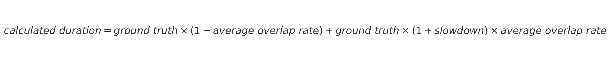
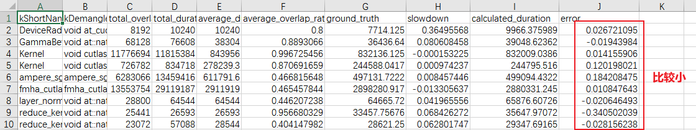

# 代码的目的和工作流程

## 最终目标

代码的最终目标是**估计特定kernel在overlap情况下的slowdown**。估计过程涉及通过一系列步骤分析和验证slowdown rate的准确性。

## 涉及的步骤

### 1. 观察slowdown的变化

- 代码首先观察到，同类kernel在不同实例中的slowdown变化范围较大，这意味着不能直接使用单次kernel 操作计算出的slowdown作为slowdown的值。
- 这种观察通过检查存储在 `slowdown_results.sqlite` 中的slowdown表格完成，这些表格由函数 `calculate_slowdown` 生成。

### 2. 计算平均slowdown

- 为了更好地估计减速，代码尝试计算同类kernel实例的**平均slowdown**。
- 这是通过函数 `calculate_average_slowdown` 实现的，该函数处理slowdown数据并计算每种kernel类型的平均值。

### 3. 验证平均slowdown的准确性

- 为确保计算出的平均slowdown是准确的，代码通过比较部分重叠的kernel的duration来验证它。
- 在验证步骤中，代码使用平均slowdown来计算每个部分重叠kernel的 `calculated_duration`。
- 公式如下：
  
  
  
- 然后，代码将这个 `calculated_duration` 与实际测量的 `average_duration`（平均持续时间）进行比较，查看是否存在显著差异。
- 如果 `average_duration` 和 `calculated_duration` 之间的差异在合理范围内（即，相对较小），则认为平均slowdown是准确的。
- 代码随后可以使用这个平均slowdown来表示kernel的实际减速。

## 总结

通过这些步骤，代码旨在可靠地估计kernel的slowdown rate。该过程涉及观察和验证，以确保计算出的slowdown rate是准确的，可以用于后续的性能分析。

## 实验结果

## 结论

可以使用average slowdown来代表通信与计算kernel overlap情况下的slowdown。