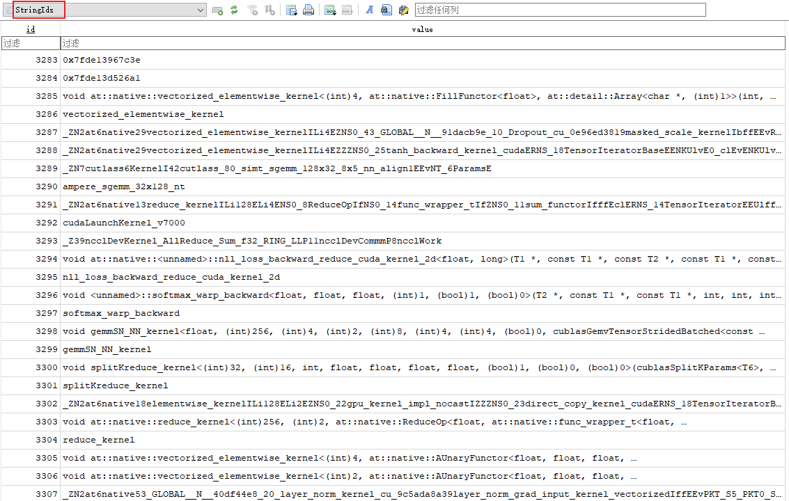
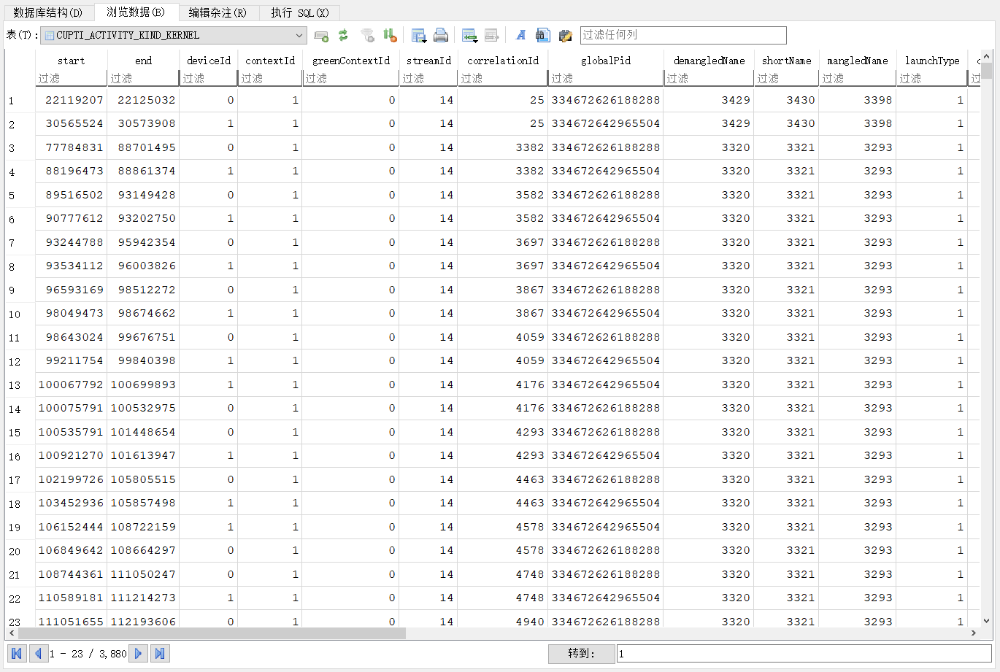

# 从nsys.rep文件中提取overlap信息

1、导出为sqlite文件

```
nsys export -t sqlite -o ${STATS_OUTPUT}.sqlite ${OUTPUT_NAME}.nsys-rep
```

2、通过sql语句对数据表进行处理，最终得到nsight system GUI的效果

> 参考：https://docs.nvidia.com/nsight-systems/UserGuide/index.html#post-collection-analysis

（1）分析导出的.sqlite文件中表格的关系

`StringIds`表储存了所有字符串名称，每个字符串对应一个唯一的索引。当然也包括了CUDA kernel的名称。



而表格`CUPTI_ACTIVITY_KIND_KERNEL`则保存了每个kernel详细的运行时信息。



> **关于shortName, mangledName 与 demangledName:**
>
> The term "mangled name" refers to the encoded name of a function or symbol in C++ (or other programming languages that support overloading). Name mangling is the process by which a compiler generates unique names for each function or variable in the program to support features like function overloading, namespaces, and templates.
>
> In your example:
>
> ```
> _ZN7cutlass6KernelI42cutlass_80_simt_sgemm_128x32_8x5_nn_align1EEvNT_6ParamsE
> ```
>
> This is a **mangled name** produced by the C++ compiler. Let's break down what this name might represent:
>
> ### Breakdown of the Mangled Name:
>
> - **`_Z`**: This prefix usually indicates that the following is a C++ function name.
> - **`N7cutlass`**: `N` indicates a namespace or class name, and `7cutlass` indicates that the namespace/class name is `cutlass` (where `7` is the length of the name `cutlass`).
> - **`6Kernel`**: This indicates that the function or method name is `Kernel` (again, `6` is the length of the name `Kernel`).
> - **`I42cutlass_80_simt_sgemm_128x32_8x5_nn_align1`**: This part of the name is more complex; it likely involves template parameters. `I` indicates the start of a template instantiation, followed by the template parameters.
> - **`EE`**: This indicates the end of the template parameter list.
> - **`v`**: Indicates the return type (`void` in this case).
> - **`NT_6ParamsE`**: This part represents the parameter list of the function.
>
> ### Demangling:
>
> To make this name human-readable, it needs to be "demangled." Many tools, like `c++filt`, are available for demangling such names. After demangling, this name might look something like:
>
> ```
> void cutlass::Kernel<cutlass_80_simt_sgemm_128x32_8x5_nn_align1>(cutlass::Params)
> ```
>
> This is a hypothetical demangling of the name. The actual demangled name will depend on the exact code and context in which this function was defined.
>
> ### Purpose:
>
> The mangled name uniquely identifies a function or symbol, especially in complex scenarios involving templates, namespaces, and overloaded functions, ensuring that the correct function is linked and called during execution.
>
> In summary, **mangled names** are how the compiler encodes functions or symbols to manage complex C++ features, and **demangled names** are their human-readable counterparts. In your database, the `mangledName` column likely stores these compiler-generated names for kernel functions, while the `demangledName` column would store the human-readable version if available.

这样，我们获得到了计算overlap比例以及真实slowdown所需要的所有信息。

此外，由于我们不感兴趣optimize阶段的信息，可以通过nvtx来对不同的阶段进行标记，然后过滤掉该部分的内容。这一步骤与.sqlite中的`NVTX_EVENTS`表相关。

```

```

3、通过start/end/duration计算overlap比例

通过SQL来计算：

```python
# Calculate overlap time using SQL and update the overlap_time column
    cursor.execute('''
    WITH Overlaps AS (
        SELECT 
            c.deviceId AS device_id,
            c.start AS compute_start,
            c.end AS compute_end,
            SUM(
                CASE
                    WHEN c.start < m.end AND c.end > m.start THEN
                        MIN(c.end, m.end) - MAX(c.start, m.start)
                    ELSE 0
                END
            ) AS total_overlap_time
        FROM CUPTI_ACTIVITY_KIND_KERNEL c
        JOIN CUPTI_ACTIVITY_KIND_KERNEL m
        ON c.deviceId = m.deviceId
        AND m.kShortName LIKE '%nccl%'
        AND c.kShortName NOT LIKE '%nccl%'
        GROUP BY c.deviceId, c.start, c.end
    )
    UPDATE CUPTI_ACTIVITY_KIND_KERNEL
    SET overlap_time = (
        SELECT total_overlap_time 
        FROM Overlaps 
        WHERE Overlaps.device_id = CUPTI_ACTIVITY_KIND_KERNEL.deviceId
        AND Overlaps.compute_start = CUPTI_ACTIVITY_KIND_KERNEL.start
        AND Overlaps.compute_end = CUPTI_ACTIVITY_KIND_KERNEL.end
    );
    ''')

    # Calculate overlap ratio and update the overlap_ratio column
    cursor.execute('''
    UPDATE CUPTI_ACTIVITY_KIND_KERNEL
    SET overlap_ratio = CAST(overlap_time AS REAL) / duration
    WHERE duration > 0;
    ''')
```

4、分离出那些有overlap与无overlap的compute kernel，计算slowdown

