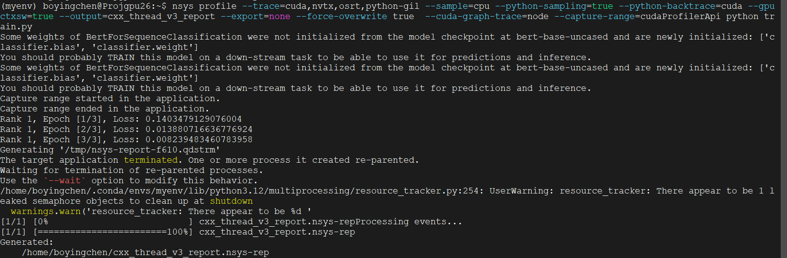

# 使用pytorch分布式地微调预训练过的模型

### 1、背景

**预训练（Pretraining）**

预训练是指在一个大型数据集上训练一个深度学习模型，通常是为了捕捉通用的特征或模式。在这个过程中，模型学会理解数据的基本结构，比如文本中的词语关系、图像中的边缘和纹理等。预训练的模型通常是基于无监督或自监督学习的方式进行的，因为这些方法不需要标注数据。预训练的模型可以通过公开的数据集（如ImageNet、COCO、GPT的文本数据等）来完成。

**微调（Fine-tuning）**

微调是在预训练模型的基础上进行的进一步训练，目的是让模型适应特定任务。通常情况下，微调使用的是一个较小且标注了的数据集。微调的过程包括以下几个步骤：

1. **加载预训练模型**：首先，从预训练阶段保存的模型中加载权重和结构。
2. **冻结部分参数**：为了保留预训练过程中学到的通用特征，通常会冻结模型的一部分参数（例如早期层的权重），只对后期的特定层进行训练。
3. **特定任务训练**：使用新数据集对模型进行训练，使其适应新的任务。这通常会提高模型在特定任务上的表现。
4. **调整学习率和参数**：微调时通常使用较低的学习率，以避免大幅改变已经学到的通用特征。

这种方法使得在资源有限的情况下也能利用大量数据训练的优势，同时也能通过少量标注数据使模型专注于特定任务。

### 2、代码分析

##### （1）设置环境和分布式进程组

```python
import os
import torch
import torch.distributed as dist

# 设置进程组函数
# 该函数设置分布式训练所需的环境变量，并初始化进程组
def setup(rank, world_size):
    # 设置主节点的地址和端口号，分布式训练的所有节点都需要访问这个地址
    os.environ['MASTER_ADDR'] = 'localhost'
    os.environ['MASTER_PORT'] = '12355'
    
    # 初始化分布式进程组，使用NCCL后端
    dist.init_process_group("nccl", rank=rank, world_size=world_size)
    
    # 将当前进程绑定到特定的GPU设备上
    torch.cuda.set_device(rank)

# 清理进程组函数
# 训练完成后，销毁分布式进程组，释放资源
def cleanup():
    dist.destroy_process_group()
```

##### （2）下载模型和数据集，并进行预处理

```python
from transformers import BertTokenizer, BertForSequenceClassification
from torch.nn.parallel import DistributedDataParallel as DDP
from torch.utils.data import DataLoader, DistributedSampler
from datasets import load_dataset

# 预处理函数
# 该函数负责下载BERT预训练模型和IMDB数据集，并进行必要的预处理
def prepare(rank, world_size):
    # 初始化进程组
    setup(rank, world_size)

    # 加载预训练的BERT模型和对应的分词器
    tokenizer = BertTokenizer.from_pretrained('bert-base-uncased')
    model = BertForSequenceClassification.from_pretrained('bert-base-uncased')
    
    # 将模型加载到指定的GPU设备上
    model.to(rank)
    
    # 使用DDP封装模型，方便分布式训练
    model = DDP(model, device_ids=[rank])

    # 下载IMDB数据集
    dataset = load_dataset('imdb')

    # 数据预处理函数，主要是对文本进行分词和截断
    def preprocess_function(examples):
        return tokenizer(examples['text'], padding='max_length', truncation=True)
    
    # 对整个数据集进行预处理，并设置数据格式
    encoded_dataset = dataset.map(preprocess_function, batched=True)
    encoded_dataset.set_format(type='torch', columns=['input_ids', 'attention_mask', 'label'])

    # 创建分布式数据采样器和数据加载器，用于在多个进程间分发数据
    train_sampler = DistributedSampler(encoded_dataset['train'], num_replicas=world_size, rank=rank)
    train_loader = DataLoader(encoded_dataset['train'], batch_size=8, sampler=train_sampler)
    
    return model, train_loader, tokenizer
```

##### （3）定义训练函数并追踪最后一个 epoch 的 10 个迭代

```python
import torch.nn as nn
import torch.optim as optim

# 训练函数
# 该函数执行模型的训练过程，并使用CUDA的NVTX工具追踪指定的迭代过程
def train(model, train_loader, rank):
    # 定义损失函数，并将其加载到GPU设备上
    criterion = nn.CrossEntropyLoss().to(rank)
    
    # 定义优化器，使用AdamW算法
    optimizer = optim.AdamW(model.parameters(), lr=2e-5)

    # 计算总的迭代次数，3个epoch的迭代次数总和
    nb_iters = len(train_loader) * 3
    
    # 计算最后一个epoch开始的迭代号
    last_epoch_start = nb_iters - len(train_loader)
    
    # 设置profile开始的迭代点，只追踪最后一个epoch中的10个迭代
    warmup_iters = last_epoch_start + (len(train_loader) - 10)
    
    model.train()  # 将模型设置为训练模式
    for epoch in range(3):  # 训练3个epoch
        # 每个epoch时重新打乱数据，确保模型的泛化能力
        train_loader.sampler.set_epoch(epoch)
        
        for i, batch in enumerate(train_loader):
            # 计算全局迭代次数
            global_iter = i + epoch * len(train_loader)

            # 将数据加载到指定的GPU设备上
            inputs = batch['input_ids'].to(rank)
            attention_mask = batch['attention_mask'].to(rank)
            labels = batch['label'].to(rank)

            optimizer.zero_grad()  # 每次迭代前清空梯度

            # 在指定的迭代点开始profiling
            if global_iter == warmup_iters:
                torch.cuda.cudart().cudaProfilerStart()

            # 推入当前迭代范围，给当前迭代打上标记
            if global_iter >= warmup_iters:
                torch.cuda.nvtx.range_push(f"Epoch {epoch + 1}, Iteration {i + 1}")

            # 推入前向传播范围
            if global_iter >= warmup_iters:
                torch.cuda.nvtx.range_push("Forward")
            outputs = model(inputs, attention_mask=attention_mask, labels=labels)
            if global_iter >= warmup_iters:
                torch.cuda.nvtx.range_pop()

            # 计算损失
            loss = outputs.loss

            # 推入反向传播范围
            if global_iter >= warmup_iters:
                torch.cuda.nvtx.range_push("Backward")
            loss.backward()  # 计算梯度
            if global_iter >= warmup_iters:
                torch.cuda.nvtx.range_pop()

            # 推入优化器更新范围
            if global_iter >= warmup_iters:
                torch.cuda.nvtx.range_push("Optimizer Step")
            optimizer.step()  # 更新模型参数
            if global_iter >= warmup_iters:
                torch.cuda.nvtx.range_pop()

            # 弹出当前迭代范围
            if global_iter >= warmup_iters:
                torch.cuda.nvtx.range_pop()

        # 在最后一个epoch的最后一个迭代点结束profiling
        if global_iter == nb_iters - 1:
            torch.cuda.cudart().cudaProfilerStop()

        # 打印当前进程的损失值
        print(f"Rank {rank}, Epoch [{epoch+1}/3], Loss: {loss.item()}")
```

##### （4）运行分布式训练

启动分布式训练：

```python
import torch.multiprocessing as mp

# 分布式训练主函数
# 该函数负责初始化训练并在多个GPU上进行模型的训练
def run_training(rank, world_size):
    # 准备模型、数据加载器和分词器
    model, train_loader, tokenizer = prepare(rank, world_size)
    
    # 执行训练过程
    train(model, train_loader, rank)
    
    # 训练结束后保存模型和分词器
    if rank == 0:
        model.module.save_pretrained('./fine_tuned_bert')
        tokenizer.save_pretrained('./fine_tuned_bert')
    
    # 清理分布式进程组
    cleanup()

# 主函数，启动多个进程进行分布式训练
def main():
    world_size = torch.cuda.device_count()  # 获取可用的GPU数量
    mp.spawn(run_training, args=(world_size,), nprocs=world_size, join=True)

if __name__ == '__main__':
    main()
```

### 3、运行结果


