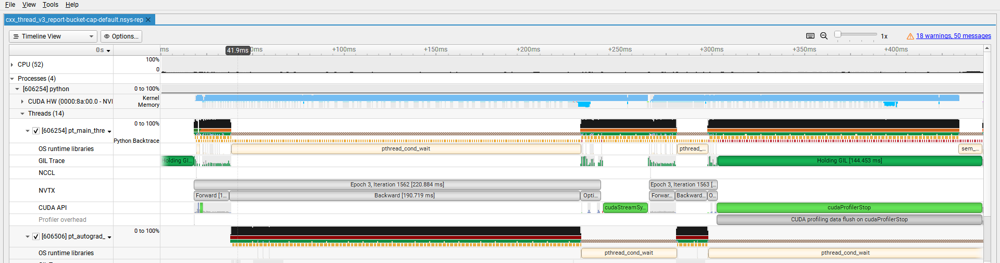

# 使用torch.cuda.nvtx库追踪预热后的训练迭代

### 1、背景介绍

（1）预热对模型训练的影响

在深度学习模型训练中，Warm-Up是一种重要的技巧，可以帮助模型更快地收敛并**提高训练稳定性**。

> 也就是说，未经warm-up的训练迭代可能是不稳定的

Warm-Up的基本原理是在训练初期，通过**逐渐增加学习率或减小优化器的梯度下降幅度**，使模型逐渐适应训练过程。这样可以避免模型在训练初期因为过大或过小的学习率而陷入不稳定的训练状态。

> Adam（Adaptive Moment Estimation），自适应学习率优化算法

（2）torch.cuda.nvtx

NVTX，全称NVIDIA Tools Extension，是一组旨在为nVidia工具（如nsight system）提供扩展功能的API。但是pytorch中已经集成了相关功能，使用时无需`import nvtx`

> 相关网页和讨论：https://discuss.pytorch.org/t/nvtx-range-push-pop-like-facility-in-torch-profiler/202431（torch.cuda.nvtx与torch.profiler联合使用）
>
> https://github.com/pytorch/kineto/issues/318

### 2、代码中用到的torch.cuda.nvtx API的文档

| API                                                          | Discription                                                  |
| ------------------------------------------------------------ | ------------------------------------------------------------ |
| [`nvtx.mark`](https://pytorch.org/docs/stable/generated/torch.cuda.nvtx.mark.html#torch.cuda.nvtx.mark) | Describe an instantaneous event that occurred at some point. |
| [`nvtx.range_push`](https://pytorch.org/docs/stable/generated/torch.cuda.nvtx.range_push.html#torch.cuda.nvtx.range_push) | Push a range onto a stack of nested range span.              |
| [`nvtx.range_pop`](https://pytorch.org/docs/stable/generated/torch.cuda.nvtx.range_pop.html#torch.cuda.nvtx.range_pop) | Pop a range off of a stack of nested range spans.            |
| [`nvtx.range`](https://pytorch.org/docs/stable/generated/torch.cuda.nvtx.range.html#torch.cuda.nvtx.range) | Context manager / decorator that pushes an NVTX range at the beginning of its scope, and pops it at the end. |

可以看到，集成的接口还是比较少的，如果需要用到NVTX的其他特性（domain、resource naming/tracking[相关api文档应该在anotation下]），需安装并使用nvtx库（见[`安装使用nVidia NVTX库.md`](./安装使用nVidia NVTX库.md)）

### 3、使用torch.cuda.nvtx追踪预热后的迭代(最后1个epoch)

```python
import os
import torch
import torch.distributed as dist
import torch.nn as nn
import torch.optim as optim
from torch.nn.parallel import DistributedDataParallel as DDP
from torch.utils.data import DataLoader, DistributedSampler
from transformers import BertTokenizer, BertForSequenceClassification
from datasets import load_dataset

# 设置进程组
def setup(rank, world_size):
    os.environ['MASTER_ADDR'] = 'localhost'
    os.environ['MASTER_PORT'] = '12355'
    dist.init_process_group("nccl", rank=rank, world_size=world_size)
    torch.cuda.set_device(rank)

# 清理进程组
def cleanup():
    dist.destroy_process_group()

# 下载预训练模型和数据集并进行预处理
def prepare(rank, world_size):
    setup(rank, world_size)

    # 加载预训练的BERT模型和分词器
    tokenizer = BertTokenizer.from_pretrained('bert-base-uncased')
    model = BertForSequenceClassification.from_pretrained('bert-base-uncased')
    model.to(rank)
    
    # 封装为DDP模型
    model = DDP(model, device_ids=[rank])

    # 下载IMDB数据集
    dataset = load_dataset('imdb')

    # 数据预处理函数
    def preprocess_function(examples):
        return tokenizer(examples['text'], padding='max_length', truncation=True)
    
    encoded_dataset = dataset.map(preprocess_function, batched=True)
    encoded_dataset.set_format(type='torch', columns=['input_ids', 'attention_mask', 'label'])

    # 创建分布式数据采样器和数据加载器
    train_sampler = DistributedSampler(encoded_dataset['train'], num_replicas=world_size, rank=rank)
    train_loader = DataLoader(encoded_dataset['train'], batch_size=8, sampler=train_sampler)
    
    return model, train_loader, tokenizer

# 训练函数
def train(model, train_loader, rank):
    criterion = nn.CrossEntropyLoss().to(rank)
    optimizer = optim.AdamW(model.parameters(), lr=2e-5)

    nb_iters = len(train_loader) * 3  # 3个epoch总的迭代次数
    last_epoch_start = nb_iters - len(train_loader)  # 最后一个epoch开始的迭代号
    warmup_iters = last_epoch_start + (len(train_loader) - 1)  # 仅追踪最后1个epoch中的1个迭代
    
    model.train()
    for epoch in range(3):  # 训练3个epoch
        train_loader.sampler.set_epoch(epoch)  # 每个epoch时打乱数据
        for i, batch in enumerate(train_loader):
            global_iter = i + epoch * len(train_loader)

            inputs = batch['input_ids'].to(rank)
            attention_mask = batch['attention_mask'].to(rank)
            labels = batch['label'].to(rank)

            optimizer.zero_grad()

            # 开始profiling，在最后1个迭代之前开始
            if global_iter == warmup_iters:
                torch.cuda.cudart().cudaProfilerStart()

            # 推入当前迭代范围
            if global_iter >= warmup_iters:
                torch.cuda.nvtx.range_push(f"Epoch {epoch + 1}, Iteration {i + 1}")

            # 推入前向传播范围
            if global_iter >= warmup_iters:
                torch.cuda.nvtx.range_push("Forward")
            outputs = model(inputs, attention_mask=attention_mask, labels=labels)
            if global_iter >= warmup_iters:
                torch.cuda.nvtx.range_pop()

            loss = outputs.loss

            # 推入反向传播范围
            if global_iter >= warmup_iters:
                torch.cuda.nvtx.range_push("Backward")
            loss.backward()
            if global_iter >= warmup_iters:
                torch.cuda.nvtx.range_pop()

            # 推入优化器更新范围
            if global_iter >= warmup_iters:
                torch.cuda.nvtx.range_push("Optimizer Step")
            optimizer.step()
            if global_iter >= warmup_iters:
                torch.cuda.nvtx.range_pop()

            # 弹出当前迭代范围
            if global_iter >= warmup_iters:
                torch.cuda.nvtx.range_pop()

        # 结束profiling
        if global_iter == nb_iters - 1:
            torch.cuda.cudart().cudaProfilerStop()

        print(f"Rank {rank}, Epoch [{epoch+1}/3], Loss: {loss.item()}")

# 运行分布式训练
import torch.multiprocessing as mp

def run_training(rank, world_size):
    model, train_loader, tokenizer = prepare(rank, world_size)
    train(model, train_loader, rank)
    
    if rank == 0:
        model.module.save_pretrained('./fine_tuned_bert')
        tokenizer.save_pretrained('./fine_tuned_bert')
    
    cleanup()

# 主函数
def main():
    world_size = torch.cuda.device_count()
    mp.spawn(run_training, args=(world_size,), nprocs=world_size, join=True)

if __name__ == '__main__':
    main()

```

结果：


