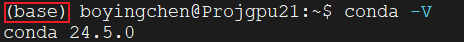
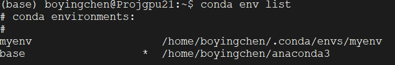
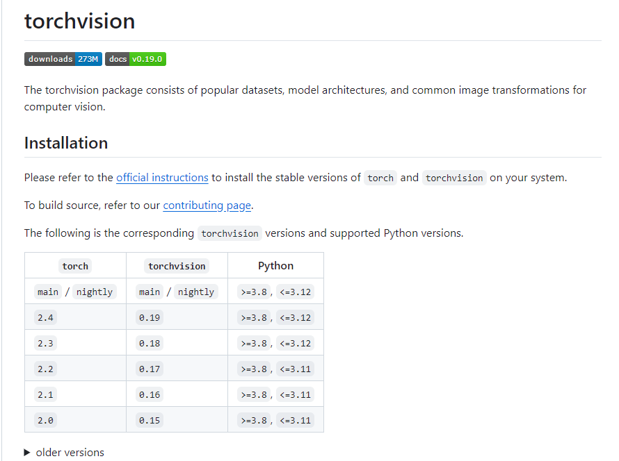
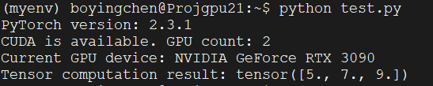

# 安装使用conda和pytorch

1、安装Anaconda

```
#下载
wget https://repo.anaconda.com/archive/Anaconda3-2024.06-1-Linux-x86_64.sh
#添加可执行权限
sudo chmod +x Anaconda3-2024.06-1-Linux-x86_64.sh
#运行
sudo ./Anaconda3-2024.06-1-Linux-x86_64.sh
```

进入注册信息页面，输入yes；阅读注册信息，然后输入yes；查看文件即将安装的位置，按enter，即可安装。这里最好把默认安装位置/root/Anaconda3改为用户的家目录（如我的是/home/boyingchen）。安装完成后，收到加入环境变量的提示信息，输入yes。

在~/.bashrc末尾添加两行：

```
export PATH="~/anaconda3/bin":$PATH
source ~/anaconda3/bin/activate #修改终端的默认 python 为 anaconda
```

然后启用执行 `source ~/.bashrc`更新配置。

至此，conda安装及base环境激活成功。



> base环境一般用于管理其他虚拟环境

2、使用conda创建虚拟环境

```
conda create -n myenv python=3.12
```



启用虚拟环境

```
conda activate [env_name]
```

失能当前被激活的虚拟环境

```
conda deactivate
```

列出所有虚拟环境

```
conda env list
```

删除特定虚拟环境

```
conda env remove -n [env_name]
```

3、在虚拟环境中安装配置正确版本的pytorch

查看CUDA版本

```bash
cat /usr/local/cuda/version.json
```

输出：

```
{
   "cuda" : {
      "name" : "CUDA SDK",
      "version" : "11.8.20220929"
   },
   "cuda_gdb" : {
      "name" : "CUDA GDB",
      "version" : "11.8.86"
   },
   "cuda_nvcc" : {
      "name" : "CUDA NVCC",
      "version" : "11.8.89"
   },
   "nvidia_driver" : {
      "name" : "NVIDIA Linux Driver",
      "version" : "520.61.05"
   },
   ......
}

```

查看cuDNN版本

> CUDA的一个加速库

```bash
grep CUDNN_MAJOR /usr/local/cuda/include/cudnn_version.h
```

结果

```
#define CUDNN_MAJOR 8
#define CUDNN_VERSION (CUDNN_MAJOR * 1000 + CUDNN_MINOR * 100 + CUDNN_PATCHLEVEL)
```

结论：正确匹配（CUDA 11.8 + cuDNN 8.x）

（1）查找CUDA11.8对应的torch版本：

https://pytorch.org/get-started/previous-versions/

```
# CUDA 11.8
conda install pytorch==2.3.1 torchvision==0.18.1 torchaudio==2.3.1 pytorch-cuda=11.8 -c pytorch -c nvidia
# CUDA 12.1
conda install pytorch==2.3.1 torchvision==0.18.1 torchaudio==2.3.1 pytorch-cuda=12.1 -c pytorch -c nvidia
# CPU Only
conda install pytorch==2.3.1 torchvision==0.18.1 torchaudio==2.3.1 cpuonly -c pytorch
```

（2）查找torch对应的python版本

https://github.com/pytorch/vision#installation



因此选择python3.12.4 + pytorch==2.3.1+ torchvision==0.18.1 + torchaudio==2.3.1

```
conda install pytorch==2.3.1 torchvision==0.18.1 torchaudio==2.3.1 pytorch-cuda=11.8 -c pytorch -c nvidia
```

4、验证安装：执行下列代码

```python
import torch

# 检查 PyTorch 是否安装成功
print(f"PyTorch version: {torch.__version__}")

# 检查 CUDA 是否可用（即是否支持 GPU）
if torch.cuda.is_available():
    print(f"CUDA is available. GPU count: {torch.cuda.device_count()}")
    print(f"Current GPU device: {torch.cuda.get_device_name(torch.cuda.current_device())}")
else:
    print("CUDA is not available. Using CPU.")

# 测试张量运算
x = torch.tensor([1.0, 2.0, 3.0])
y = torch.tensor([4.0, 5.0, 6.0])
z = x + y
print(f"Tensor computation result: {z}")
```



说明安装成功。
