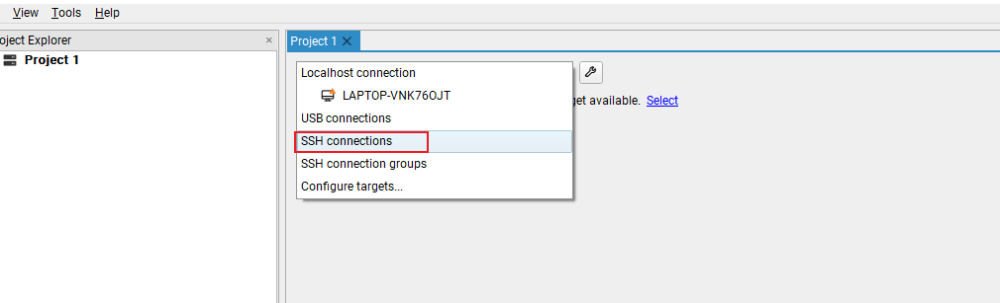

# 安装使用nVidia Nsight System

1、在Windows上安装Nsight Systems Host

> https://developer.nvidia.com/gameworksdownload


2、在服务器上下载Linux CLI软件包

```
wget https://developer.nvidia.com/downloads/assets/tools/secure/nsight-systems/2024_5/NsightSystems-linux-cli-public-2024.5.1.113-3461954.deb
```

安装

```
sudo dpkg -i NsightSystems-linux-cli-public-2024.5.1.113-3461954.deb
```

查看版本

```
nsys --version
```

3、在Windows host上ssh远程连接服务器采集数据



hostname：projgpu21.cse.cuhk.edu.hk，username：boyingchen，port：22

连接成功后会显示如下界面，在Command line中填写执行的命令，之后点击右侧的Start开始执行


例如，使用nsight测试运行nccl-tests时的资源消耗情况的结果：


4、使用命令行程序nsys收集数据

> 参考：https://docs.nvidia.com/nsight-systems/UserGuide/index.html#

使用方法

```
nsys [global-options][command_switch][optional command_switch_options][application] [optional application_options]
```

**CLI Command Switches**

| command | description                                                  |
| :------ | ------------------------------------------------------------ |
| profile | A fully formed profiling description requiring and accepting no further input. The command switch options used (see below table) determine when the collection starts, stops, what collectors are used (e.g. API trace, IP sampling, etc.), what processes are monitored, etc. |
| stats   | Post process existing Nsight Systems result, either in .nsys-rep or SQLite format, to generate statistical information. |
| analyze | Post process existing Nsight Systems result, either in .nsys-rep or SQLite format, to generate expert systems report. |

也提供了其他很多interactive mode相关的选项，详见文档。

**CLI Profile Command Switch Options**

这里选择Command Switches的参数（列出的为全局的常用参数，有一些Command Switches如Analyse有自己的一套options）

| short | long            | Possible Parameters                                          | default                  | description                                                  |
| ----- | --------------- | ------------------------------------------------------------ | ------------------------ | ------------------------------------------------------------ |
| -o    | `--output`      | `<filename>`                                                 | report                   | 设置报告文件名。文件名中的任何 `%q{ENV_VAR}` 模式将被环境变量的值替换。任何 `%h` 模式将被系统的主机名替换。任何 `%p` 模式将被目标进程的进程ID（PID）替换，如果有进程树，则替换为根进程的PID。任何 `%%` 模式在文件名中将被替换为 `%`。默认情况下，在工作目录中为 `report#.{nsys-rep,sqlite,h5,txt,arrows,json}`。 |
| -t    | `--trace`       | cuda, nvtx, cublas, cublas-verbose, cusparse, cusparse-verbose, cudnn, cudla, cudla-verbose, cusolver, cusolver-verbose, opengl, opengl-annotations, openacc, openmp, osrt, mpi, nvvideo, vulkan, vulkan-annotations, dx11, dx11-annotations, dx12, dx12-annotations, openxr, openxr-annotations, oshmem, ucx, wddm, tegra-accelerators, python-gil, syscall, none | cuda, opengl, nvtx, osrt | 选择要追踪的 API。`osrt` 开关控制操作系统运行时库的追踪。可以选中多个 API，用逗号分隔（没有空格）。由于 OpenACC 和 cuXXX API 与 CUDA 紧密关联，选择这些 API 之一将自动启用 CUDA 追踪。cublas、cudla、cusparse 和 cusolver 都提供了 XXX-verbose 选项。当启用 DX 或 vulkan API 追踪时，Reflex SDK 延迟标记将自动被收集。如果选择了 mpi，请查看下面关于 `--mpi-impl` 选项的信息。如果选择了 `<api>-annotations`，则相应的 API 也会被追踪。如果选择了 none 选项，则不会追踪任何 API，并且不能选择其他 API。注意：cudnn 在 Windows 目标上不可用。 |
| -w    | `--show-output` | true, false                                                  | true                     | 如果设置为 true，则将目标进程的标准输出（stdout）和标准错误（stderr）流同时发送到控制台以及添加到报告文件中的 stdout/stderr 文件。如果设置为 false，则只将目标进程的标准输出和标准错误流发送到添加到报告文件中的 stdout/stderr 文件。 |
| -s    | `--sample`      | process-tree, system-wide, none                              | process-tree             | 选择如何收集 CPU 指令指针/回溯（IP/backtrace）样本。如果选择 “none”，则禁用 CPU 采样。根据不同平台，某些值可能需要管理员或 root 权限。如果目标应用程序被启动，则默认为 “process-tree”，否则，默认为 “none”。注意：“system-wide” 在所有平台上都不可使用。注意：如果设置为 “none”，除非 `--cpuctxsw` 开关被设置为 “none”，否则 CPU 上下文切换数据仍将被收集。 |
|       | `--cpuctxsw`    | process-tree, system-wide, none                              | process-tree             | 追踪操作系统线程调度活动。选择“none”以禁用追踪 CPU 上下文切换。根据不同平台，某些值可能需要管理员或 root 权限。注意：如果 `--sample` 开关设置为除“none”之外的值，`--cpuctxsw` 设置将被硬编码为与 `--sample` 开关相同的值。如果 `--sample=none` 且启动了目标应用程序，则默认为“process-tree”，否则默认为“none”。需要在 Nsight Systems Embedded Platforms Edition 中使用 `--sampling-trigger=perf` 开关。 |

使用命令行测试nccl-tests的性能：

```bash
nsys profile --trace=cuda,cudnn,cublas,osrt,nvtx -f true -o baseline ./build/all_reduce_perf -b 8 -e 128M -f 2 -g 2
```

结果：


得到的测试数据在`.nsys-rep`中。

5、在Windows Host上查看使用命令行nsys收集的数据

（1）下载`.nsys-rep`报告文件


（2）直接点开