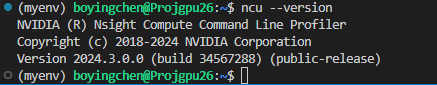

# 安装使用nsight compute

1、命令行安装

```
sudo apt install nsight-compute
```

apt会列出可供安装的版本，选择最新版：

```
Reading package lists... Done
Building dependency tree       
Reading state information... Done
Package nsight-compute is a virtual package provided by:
  nsight-compute-2024.3.0 2024.3.0.15-1
  nsight-compute-2024.2.1 2024.2.1.2-1
  nsight-compute-2024.2.0 2024.2.0.16-1
  nsight-compute-2024.1.1 2024.1.1.4-1
  nsight-compute-2024.1.0 2024.1.0.13-1
  nsight-compute-2023.3.1 2023.3.1.1-1
  nsight-compute-2023.3.0 2023.3.0.12-1
......
```

将路径加入环境变量

```cmd
# 寻找可执行程序的位置
sudo find / -name ncu 2>/dev/null
# 结果：/opt/nvidia/nsight-compute/2024.3.0/ncu，在.bashrc的末尾添加一行
export PATH=$PATH:/opt/nvidia/nsight-compute/2024.3.0/
# 更新
source .bashrc
```

查看版本

```
ncu --version
```



2、可能有用：

（1）Range Replay[](https://docs.nvidia.com/nsight-compute/ProfilingGuide/index.html#range-replay)

In *Range Replay*, all requested metrics in NVIDIA Nsight Compute are grouped into one or more passes. In contrast to [Kernel Replay](https://docs.nvidia.com/nsight-compute/ProfilingGuide/index.html#kernel-replay) and [Application Replay](https://docs.nvidia.com/nsight-compute/ProfilingGuide/index.html#application-replay), *Range Replay* captures and replays complete ranges of CUDA API calls and kernel launches within the profiled application. Metrics are then not associated with individual kernels but with the entire range. **This allows the tool to execute kernels without serialization and thereby supports profiling kernels that should be run concurrently for correctness or performance reasons.**


*Execution with Range Replay. An entire range of API calls and kernel launches is captured and replayed. Host and device memory is saved and restored as necessary.*

在CLI中使用ncu时可以通过参数`--replay-mode` 来指定replay的模式

