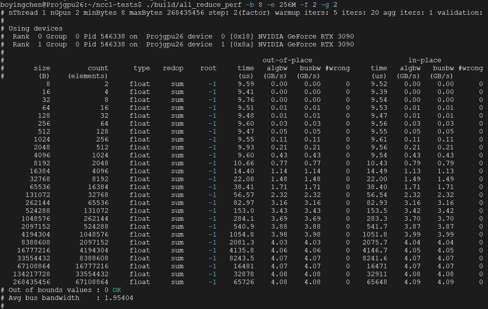

# 安装正确版本的NCCL库以及nccl-testst

### 1、nccl库

（1）构建

```bash
git clone https://github.com/NVIDIA/nccl.git
cd nccl
make -j src.build NVCC_GENCODE="-gencode=arch=compute_86,code=sm_86"
```

（2）安装

```bash
# Install tools to create debian packages
sudo apt install build-essential devscripts debhelper fakeroot
# Build NCCL deb package
make pkg.debian.build
ls build/pkg/deb/
#install
sudo dpkg -i libnccl_2.22.3-1+cuda11.8_amd64.deb
sudo dpkg -i libnccl-dev_2.22.3-1+cuda11.8_amd64.deb #顺序不能变，否则会有依赖问题
```

验证：

```
dpkg -l | grep nccl
```

nccl版本：2.22.3

> 若想安装其他版本，需在Git切换分支，使用`git tag`查看可用分支。

### 2、nccl-tests

```bash
git clone https://github.com/NVIDIA/nccl-tests.git
cd nccl-tests
make
./build/all_reduce_perf -b 8 -e 256M -f 2 -g 2
```

测试结果：



