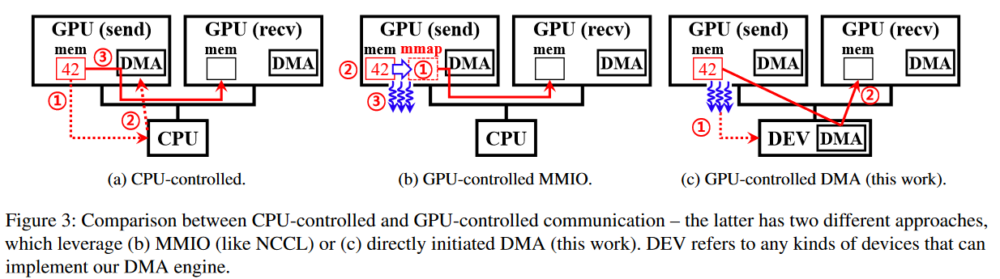

# NCCL useful insight

1.提到NCCL的topology-aware特性以及该特性的作用

One of the primary techniques employed today to minimize the impact of communication is to overlap it behind compute. This is enabled via clever fabric topologies [17], [26] accompanied by **topology-aware collective communication** algorithms (e.g., Ring and Double-binary tree for All-reduce) implementations in libraries like Intel’s MLSL [23]/oneCCL [7] and NVIDIA’s NCCL [42].

> 来自：Enabling Compute-Communication Overlap in Distributed Deep Learning Training Platforms(2021, ISCA)

2.提到NCCL的GPUDirect技术如何造成了计算与通信之间的互相影响，进而带来slowdown.

> 就是说，NCCL可以利用GPUDirect来实现GPU线程之间的直接通信，从而减少CPU的参与，并提高通信效率。然而，尽管这种机制允许GPU线程进行数据传输，但是由于现有硬件的限制（gap），底层要使用MMIO来实现。而MMIO最终会带来问题

Since CPU intervention incurs a large overhead, how about managing the communication with GPU itself? NCCL leverages GPUDirect to enable this approach, which exposes the GPU memory space for peer-to-peer access so that GPU threads can read/write data to/from another GPU.

As GPU threads can directly invoke data copy, they can handle communication events efficiently without the involvement of CPU. Since commodity GPU hardware disallows GPU threads to initiate its own DMA engine, GPU-controlled communication leverages MMIO, which will implicitly conduct DMA when GPU threads write data on the mapping. Figure 3 compares CPU-controlled and GPU-controlled communication. The former one (Figure 3a) takes the following steps: 

 1.CPU is notified when the data is ready

 2.CPU initiates the DMA engine

 3.DMA copies the data. 

On the other hand, GPU-controlled communication with MMIO (Figure 3b) follows 

1.CPU creates a memory map (mmap) of the destination GPU’s address space prior to runtime execution

2.the data is ready at runtime

3.GPU threads copy the data into the mmap, which implicitly conducts DMA copy. 

**Unfortunately, data copying by GPU threads often heavily interferes with parallel kernel computation, especially due to L2 cache pollution and warp scheduler operations**.

> 来自ARK: GPU-driven Code Execution for Distributed Deep Learning(2023, NSDI)
>
> NVIDIA. GPUDirect. https://developer.nvidia.com/gpudirect
>
> [GPUDirect RDMA](https://docs.nvidia.com/cuda/gpudirect-rdma/) (Developing a Linux Kernel Module using GPUDirect RDMA😀)
>
> https://github.com/FelixFu520/README/blob/main/envs/gpus/gpudirect.md (⭐GPU通信详解！)